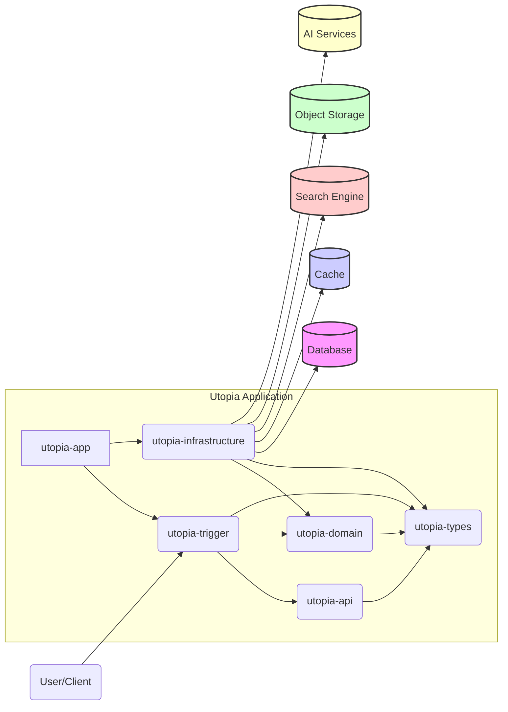

# Utopia 项目

## 简介

Utopia 是一个多功能的综合性平台，旨在提供社区交流、集市交易、文件共享、即时通讯以及智能工具等服务。项目采用现代化的 Java 技术栈和分层架构设计，具备良好的扩展性和可维护性。

## 架构设计

本项目采用经典的领域驱动设计 (DDD) 分层架构：

- **utopia-app**: 应用启动层。负责应用的组装、配置和启动。依赖所有其他层。
- **utopia-trigger**: 触发层 (适配层)。负责接收外部请求（如 HTTP API），进行协议转换和初步校验，并调用应用服务。依赖 `utopia-api`, `utopia-domain`, `utopia-types`。
- **utopia-domain**: 领域层。包含核心业务逻辑、领域模型（实体、值对象）、领域服务和领域事件。是业务规则的核心实现，不依赖其他层（除 `utopia-types`）。
- **utopia-infrastructure**: 基础设施层。提供技术实现，如数据库访问 (DAO/Mapper)、缓存操作、第三方服务集成（OSS、AI、搜索）、消息队列等。依赖 `utopia-domain`, `utopia-types`。
- **utopia-api**: API 定义层。定义数据传输对象 (DTO) 和服务接口，供 `utopia-trigger` 和可能的外部客户端使用。
- **utopia-types**: 通用类型层。包含跨层使用的常量、枚举、工具类、自定义异常、注解等基础组件。



## 主要功能模块

- **用户模块**: 用户注册、微信/账号登录、用户信息管理、头像上传。
- **社区模块**:
  - 帖子发布、浏览、详情查看。
  - 评论、点赞、收藏功能。
  - 基于用户行为的个性化帖子推荐 (User-Based Collaborative Filtering + CES Score)。
  - 系统通知。
- **集市模块**: 交易帖发布、浏览、搜索。
- **文件模块**: 文件上传、下载、列表查看、按课程分类。
- **搜索模块**: 提供社区帖子、交易帖、文件的全文检索功能 (基于 Meilisearch)。
- **消息模块**: 用户间即时通讯 (WebSocket)。
- **创作模块**: 定期话题发布与投票。
- **工具模块**:
  - GitHub 项目分析 (集成 Dify AI Workflow)。
  - 内容安全审核 (集成百度智能云，文本/图片审核)。

## 技术栈

- **后端**: Java 17, Spring Boot 3.x
- **构建工具**: Maven
- **数据库**: MySQL 8.x
- **缓存**: Redis 6.x (使用 Redisson 客户端)
- **数据持久化**: MyBatis
- **搜索引擎**: Meilisearch
- **文件存储**: 阿里云 OSS
- **AI 服务**: 百度智能云 (内容审核), Dify (工作流)
- **实时通讯**: Spring WebSocket, Netty
- **认证**: JWT (JSON Web Token)
- **核心库**: Lombok, Hutool, FastJSON, Jackson, Apache Commons Lang3, Thumbnailator, OkHttp3, Apache HttpClient
- **其他**: Sensitive Word Filter (敏感词过滤)

## 环境准备与运行

1. **环境依赖**:

   - JDK 17 或更高版本
   - Maven 3.6+
   - MySQL 8.0+
   - Redis 6.2+
   - Meilisearch
   - (可选) 阿里云 OSS Bucket 及 AccessKey/SecretKey
   - (可选) 百度智能云内容审核 API Key/SecretKey
   - (可选) Dify 平台 API Key 及 Workflow 地址

2. **配置**:

   - 修改 `utopia-app/src/main/resources/application.yml` (或其他环境配置文件)，配置数据库、Redis、Meilisearch、OSS、AI 服务等连接信息和密钥。
   - 确保 MySQL 数据库已创建，并执行 `docs/sql/` 目录下的初始化脚本（如果提供）。

3. **构建**: 在项目根目录 (<mcfolder name="utopia" path="d:\develop\Java\javacode\utopia"></mcfolder>) 执行 Maven 命令：

   ```bash
   mvn clean package -DskipTests
   ```

4. **运行**:

   ```bash
   java -jar utopia-app/target/utopia-app.jar
   ```

   或者通过 IDE 直接运行 `utopia-app` 模块下的 `Application` 类。

5. **部署:**

   可使用 docker 部署，具体参考 docker-compose-app.yml

## 目录结构

```plaintext
utopia/
├── docs/                  # 文档 (SQL, UML图等)
├── utopia-api/            # API 定义 (DTOs, Interfaces)
├── utopia-app/            # 应用启动与配置
├── utopia-domain/         # 领域核心逻辑
├── utopia-infrastructure/ # 基础设施实现 (DB, Cache, External Services)
├── utopia-trigger/        # 触发器 (HTTP Controllers)
├── utopia-types/          # 通用类型与工具
├── pom.xml                # 父 POM 文件
└── README.md              # 本文件
```

## API 文档

暂无

## 贡献指南

欢迎参与贡献！请遵循标准的 Fork & Pull Request 流程。
